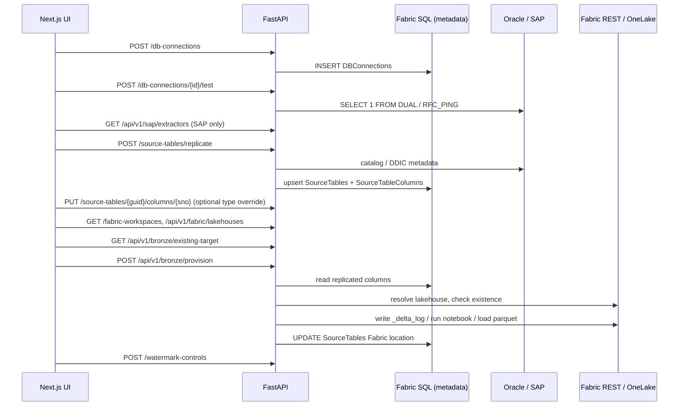

# Backend Handover – Fabric Enterprise Metadata API

This document is a complete specification of the backend in `backend/`. It is detailed enough to re-implement the service from scratch with identical behavior.

---

## 1. Purpose

A **FastAPI** service that:

1. Exposes CRUD APIs over a **metadata/config database** hosted in *SQL Database in Microsoft Fabric* (schemas `metadata_driven_transformations` and `bronze_replication`).
2. **Introspects source systems** (Oracle tables, SAP S/4HANA ODP DataSources) and persists their column definitions with a source → Fabric type conversion ("replicate").
3. **Provisions empty Bronze Delta tables** in a Fabric Lakehouse from the persisted column metadata (create / alter-add-columns / drop-recreate), using one of three strategies: direct Delta-log upload to OneLake, a Fabric Spark notebook, or a 0-row parquet + Load Table API.
4. Tracks where each source table was provisioned (workspace / lakehouse / schema / table).

---

## 2. Project Layout

```
backend/
  python-sql.py                 # Entire FastAPI app (single module; uvicorn target "python-sql:app")
  requirements.txt
  .env / .env.example           # Environment configuration (never commit real secrets)
  config/
    native_dependencies.py      # Oracle Instant Client + SAP NW RFC SDK path/DLL setup
    oracle_type_mapping.json    # Oracle -> Fabric type lookup table
    sap_type_mapping.json       # SAP DDIC -> Fabric type lookup table
  native/
    windows/oracle/instantclient_23_26/   # Oracle Instant Client (thick mode)
    windows/sap/nwrfcsdk/                 # SAP NW RFC SDK (optional; lib/ must exist)
    linux/oracle/..., linux/sap/...       # Same for Linux
  test_native_dependencies.py
```

Run:

```powershell
cd backend
python -m venv venv; venv\Scripts\activate
pip install -r requirements.txt
uvicorn python-sql:app --host 0.0.0.0 --port 8000 --reload
```

Swagger UI: `http://localhost:8000/docs`.

---

## 3. Dependencies (`requirements.txt`)

```
fastapi>=0.100.0
uvicorn[standard]>=0.22.0
mssql-python>=1.0.0
pydantic>=2.0.0
python-dotenv>=1.0.0
oracledb>=2.0.0
pyarrow>=12.0.0
requests>=2.31.0
azure-identity>=1.13.0
PyJWT>=2.8.0
pip-system-certs>=4.0
pyrfc==3.3.1        # exact pin required: newer releases are yanked, pip skips yanked releases for >= specifiers
```

Python 3.11 is used.

---

## 4. Environment Variables

| Variable | Default | Purpose |
|---|---|---|
| `DATABASE_URL` | placeholder | ODBC-style connection string to the Fabric SQL metadata DB, e.g. `Server=<host>.database.fabric.microsoft.com,1433;Database=<db>;Authentication=ActiveDirectoryDefault;Encrypt=yes` |
| `CORS_ALLOWED_ORIGINS` | `http://localhost:3000,http://127.0.0.1:3000` | Comma-separated allowed origins |
| `FABRIC_AUTH_MODE` | `service_principal` | `service_principal` or `interactive` |
| `FABRIC_TENANT_ID` / `FABRIC_CLIENT_ID` / `FABRIC_CLIENT_SECRET` | – | Service principal for Fabric REST + OneLake + Lakehouse SQL endpoint |
| `AZURE_TENANT_ID` / `AZURE_CLIENT_ID` / `AZURE_CLIENT_SECRET` | – | Used by `ActiveDirectoryDefault` (EnvironmentCredential) for `DATABASE_URL` |
| `ORACLE_USER` / `ORACLE_PASSWORD` / `ORACLE_DSN` | – | Server-wide Oracle fallback when no per-connection details are supplied |
| `ORACLE_NUMBER_DEFAULT_TYPE` | `DOUBLE` | Fabric type for Oracle `NUMBER` without precision/scale |
| `PROVISIONING_METHOD` | `direct_upload` | `direct_upload` \| `notebook` \| anything else = parquet load |
| `FABRIC_REQUEST_TIMEOUT_SECONDS` | `30` | Timeout for `fabric_get` |
| `FABRIC_GET_MAX_ATTEMPTS` | `3` | Retry attempts for `fabric_get` (min 1) |
| `ORACLE_CLIENT_PATH_OVERRIDE` | – | Absolute path overriding the bundled Instant Client |
| `SAPNWRFC_HOME_OVERRIDE` | – | Absolute path overriding the bundled NW RFC SDK |
| `SKIP_NATIVE_DEPENDENCIES` | – | `1/true/yes` skips native SDK validation |

`.env` is loaded with `load_dotenv(Path(__file__).parent / ".env")` **before** anything else is imported from `config`.

---

## 5. Startup Sequence (module import order)

1. Imports; `load_dotenv(backend/.env)`.
2. `configure_native_dependencies()` (section 6).
3. `logging.basicConfig(level=INFO, format="%(asctime)s [%(levelname)s] %(name)s: %(message)s", stdout)`; logger name `BronzeProvisioningAPI`.
4. `mssql_python.pooling(max_size=20, idle_timeout=300)`.
5. Read env vars; load `ORACLE_TYPE_MAP`, `SAP_TYPE_MAP` from `config/*.json`.
6. Constants:
   - `FABRIC_API_ROOT = "https://api.fabric.microsoft.com/v1"`
   - `FABRIC_API_SCOPE = "https://api.fabric.microsoft.com/.default"`
   - `ONELAKE_DFS_ROOT = "https://onelake.dfs.fabric.microsoft.com"`
   - `ONELAKE_STORAGE_SCOPE = "https://storage.azure.com/.default"`
7. `app = FastAPI(title="Fabric Enterprise Metadata API", version="1.1.0")` + `CORSMiddleware(allow_origins=<env>, allow_credentials=True, allow_methods=["*"], allow_headers=["*"])`.
8. `@app.on_event("startup") on_startup_ensure_schema()`:
   - Up to 3 attempts (sleep `5*attempt` s between) catching `mssql_python.exceptions.OperationalError`:
     - `_ensure_source_tables_provisioning_columns()`
     - `_ensure_fabric_workspaces_table()`
   - If all fail: log error, **app still starts**.

### 5.1 `_ensure_source_tables_provisioning_columns`
Reads `INFORMATION_SCHEMA.COLUMNS` for `bronze_replication.SourceTables`; for each missing column runs `ALTER TABLE ... ADD <col> <def>`:

| Column | Definition |
|---|---|
| IsActive | `BIT NOT NULL DEFAULT (1) WITH VALUES` |
| Delta | `NVARCHAR(4) NULL` |
| FabricWorkspaceName | `NVARCHAR(200) NULL` |
| FabricWorkspaceId | `NVARCHAR(100) NULL` |
| FabricLakehouseName | `NVARCHAR(200) NULL` |
| FabricLakehouseSchema | `NVARCHAR(100) NULL` |
| FabricTableName | `NVARCHAR(200) NULL` |
| ProvisionedTimestamp | `DATETIME2 NULL` |

Errors inside are logged as warnings and rolled back (connection errors propagate to the retry loop).

### 5.2 `_ensure_fabric_workspaces_table`
Creates if absent:
```sql
CREATE TABLE bronze_replication.FabricWorkspaces (
    Id INT IDENTITY(1,1) PRIMARY KEY,
    WorkspaceName NVARCHAR(200) NOT NULL,
    WorkspaceId NVARCHAR(100) NOT NULL,
    CreatedTimestamp DATETIME2 NOT NULL DEFAULT SYSUTCDATETIME(),
    UpdatedTimestamp DATETIME2 NOT NULL DEFAULT SYSUTCDATETIME()
)
```

---

## 6. Native Dependencies (`config/native_dependencies.py`)

- `BASE_DIR = backend/`. `PLATFORM_DIR = native/windows` or `native/linux` (other OS → `RuntimeError`).
- `ORACLE_CLIENT_PATH = ORACLE_CLIENT_PATH_OVERRIDE or PLATFORM_DIR/oracle/instantclient_23_26`.
- `SAPNWRFC_HOME = SAPNWRFC_HOME_OVERRIDE or PLATFORM_DIR/sap/nwrfcsdk`; `SAPNWRFC_LIB_PATH = SAPNWRFC_HOME/lib`.
- `configure_native_dependencies()` (idempotent via module flag `_CONFIGURED`):
  1. If `SKIP_NATIVE_DEPENDENCIES` truthy → warn, mark configured, return.
  2. Oracle client folder **must** exist → else `RuntimeError`.
  3. SAP SDK optional: if missing, log warning `SAP NW RFC SDK not found at ...; SAP/RFC native configuration will be skipped`. If present:
     - `SAPNWRFC_HOME` env var set.
     - Disable RFC traces: `RFC_TRACE=0, CPIC_TRACE=0, CPIC_TRACE_LEVEL=0, RFC_ACCEPT_EXPORTED_TRACE=0, RFC_TRACE_TYPE=PROCESS, RFC_TRACE_MAX_STORED_FILES=1`, `RFC_TRACE_DIR=<tempdir>/fabric-app-v1-sap-rfc` (created; stale `*.trc` deleted best-effort).
  4. Windows: `os.add_dll_directory()` for Oracle (and SAP lib if present); keep handles in `_DLL_HANDLES`; prepend dirs to `PATH`.
  5. Linux: prepend dirs to `LD_LIBRARY_PATH` (best effort).
- Exports: `configure_native_dependencies, ORACLE_CLIENT_PATH, SAPNWRFC_HOME, SAPNWRFC_LIB_PATH`.

---

## 7. Metadata Database Schema

Tables are **pre-existing** (not created by the app) except `FabricWorkspaces` and the added `SourceTables` columns. Column types below are inferred from the Pydantic models/queries; align with your actual DB.

### 7.1 `metadata_driven_transformations`

| Table | PK | Columns |
|---|---|---|
| `transformation_job` | job_id | job_id(100), job_name(200), source_system(50), source_schema(100), source_table(200), target_schema(100), target_table(200), load_type(30), execution_sequence INT, active_flag CHAR(1) 'Y'/'N', description(1000), created_timestamp, created_by(100), updated_timestamp, updated_by(100) |
| `transformation_rule` | rule_id | rule_id, job_id, sequence_no INT, source_column(200), target_column(200), transformation_type(30), expression, function_name(200), target_data_type(100), default_value, nullable_flag BIT, is_key BIT, active_flag BIT, key_type(30, default 'NONE'), description, audit cols |
| `validation_rule` | validation_id | validation_id, job_id, column_name(200), validation_type(50), validation_expression, severity(20), reject_record_flag BIT, active_flag BIT, error_message, description, audit cols |
| `reference_mapping` | mapping_id | mapping_id, mapping_group(100), source_system(50), source_value(500), standard_value(500), standard_description, effective_from DATE, effective_to DATE, active_flag BIT, audit cols |
| `load_config` | load_config_id | load_config_id, job_id, load_type(30), watermark_column(200), watermark_data_type(100), merge_key_columns, sequence_column(200), partition_column(200), delete_strategy(50), late_arriving_strategy(50), active_flag BIT, audit cols |
| `transformation_run` | run_id | run_id, job_id, pipeline_run_id(200), start_timestamp, end_timestamp, status(30), rows_read/inserted/updated/deleted/rejected INT, source_watermark(500), target_watermark(500), error_message, created_timestamp (no created_by/updated_*) |
| `function_registry` | function_name | function_name(200), function_type(50), implementation_reference(500), description, active_flag BIT, audit cols |

"audit cols" = `created_timestamp, created_by, updated_timestamp, updated_by`.

### 7.2 `bronze_replication`

| Table | Key | Columns |
|---|---|---|
| `watermark_control` | source_table_full_name | source_table_full_name(255), destination_table_full_name(255), watermark_column(100), watermark_column_data_type(50), last_watermark_value(255), max_row_fetch INT, ingestion_flag BIT, load_strategy(50, default 'INCREMENTAL'), merge_key_column(255), index_column_name(128), last_modified_timestamp, last_run_time |
| `DBConnections` | Id INT IDENTITY | Id, SourceType(30) (`Oracle` / `SAP S/4HANA`), ConnectionName(200), ConnectionDetails NVARCHAR(MAX) JSON, ConnectionTags NVARCHAR(MAX) JSON array, CreatedTimestamp, UpdatedTimestamp |
| `SourceTables` | GUID UNIQUEIDENTIFIER (DB default `NEWID()`) | GUID, ConnectionName(200), SourceTableName(500), DataSourceType(10), ApplicationComponent(10), Delta(4), IsActive BIT, Fabric* columns (5.1), ProvisionedTimestamp, CreatedTimestamp, UpdatedTimestamp. Logical unique key: (ConnectionName, SourceTableName) |
| `SourceTableColumns` | (GUID, Sno) | GUID (FK → SourceTables.GUID), Sno INT, ColumnName(200), Description(2000), SourceDataType(200), FabricDataType(200) |
| `FabricWorkspaces` | Id | see 5.2 |

Legacy: `dbo.employee (id INT, name NVARCHAR(100), designation NVARCHAR(100))`.

### 7.3 `ConnectionDetails` JSON shapes

Oracle:
```json
{ "host": "...", "port": 1521, "serviceName": "...", "username": "...", "password": "...",
  "schema": "OPTIONAL_DEFAULT_OWNER", "clientPath": "OPTIONAL_INSTANT_CLIENT_DIR" }
```
SAP (RFC):
```json
{ "host": "...", "systemNumber": "00", "client": "100", "username": "...", "password": "...", "language": "EN" }
```
SAP (HTTP/OData wrapper, takes precedence if any base URL key exists):
```json
{ "sap_http_base_url | odata_base_url | base_url": "http://host:port/...",
  "username": "...", "password": "...", "headers": {}, "cookie": "...", "sap-client | client": "100", "language": "EN" }
```

---

## 8. Cross-cutting Infrastructure

### 8.1 DB dependency
```python
def get_db_dependency():
    conn = mssql_python.connect(DATABASE_URL)
    cursor = conn.cursor()
    try:
        yield cursor
        conn.commit()
    except Exception:
        conn.rollback(); raise
    finally:
        cursor.close(); conn.close()   # returns to pool
```
All endpoints use named params `%(name)s` with a dict. One place (watermark auto-insert) uses `?` params with its own connection.

### 8.2 Exception handlers
| Exception | Status | Body |
|---|---|---|
| `mssql_python.DatabaseError` | 500 | `{"detail": "Database error occurred: ...", "type": "database_error"}` |
| `mssql_python.IntegrityError` | 400 | `{"detail": "Data integrity error: ...", "type": "integrity_error"}` |
| `SapMetadataError` | `exc.status_code` | `{"error": CODE, "message": msg, "detail": msg}` |
| `Exception` (catch-all) | 500 | `{"detail": "Internal server error: ...", "type": "internal_error"}` (logs stack trace; ensures CORS headers are present) |

`SapMetadataError(error_code, message, status_code=400)` codes: `SAP_CONNECTION_ERROR`, `SAP_TABLE_NOT_ALLOWED`, `SAP_HTTP_ERROR`, `SAP_RFC_ERROR`, `INVALID_DATASOURCE`, `DATASOURCE_NOT_FOUND`.

### 8.3 Standard CRUD pattern (used by all metadata tables)

- **List** `GET /<res>?page=1&page_size=10` (`page>=1`, `1<=page_size<=100`):
  `SELECT COUNT(*)` → `SELECT ... ORDER BY <pk> OFFSET skip ROWS FETCH NEXT limit ROWS ONLY`.
  Response `{items, total, page, page_size, pages}` where `pages = ceil(total/page_size)` (for DBConnections/SourceTables: `0` when total is 0).
- **Get** `GET /<res>/{id}` → 404 if missing.
- **Create** `POST /<res>` (201) → `INSERT ... OUTPUT INSERTED.* VALUES (...)`; `created_timestamp = CURRENT_TIMESTAMP`; booleans converted to `1/0`.
- **Update** `PUT /<res>/{id}` → `model_dump(exclude_unset=True)`; if empty returns current row; builds `SET col = %(col)s, ...` + `updated_timestamp = CURRENT_TIMESTAMP` (not for runs; `last_modified_timestamp` for watermark; `UpdatedTimestamp = sysutcdatetime()` for bronze tables); `OUTPUT INSERTED.*`; 404 if no row.
  Column names in SET come only from Pydantic field names (safe from injection).
- **Delete** `DELETE /<res>/{id}` (204) → 404 if `rowcount == 0`.
- Row → dict via `map_<entity>(row)`; BIT columns cast with `bool()`.
- Audit fields `created_by` / `updated_by` default `"SYSTEM"` in Create/Update models.

### 8.4 JSON naming
- `metadata_driven_transformations` and `watermark_control` APIs: **snake_case**.
- `DBConnections`, `SourceTables`, `SourceTableColumns`, `FabricWorkspaces`: Python attrs are PascalCase, JSON is **camelCase** via `Field(alias=...)` with `ConfigDict(populate_by_name=True)` (accepts either on input).
- SAP metadata endpoints: **snake_case**.

---

## 9. API Reference

### 9.1 Root / Health
| Method | Path | Behavior |
|---|---|---|
| GET | `/` | `{"message": "Welcome to the Microsoft Fabric SQL Database API", "documentation": "/docs", "status": "online"}` |
| GET | `/health` | `SELECT 1` → `{"status":"healthy","database":"connected","verified":true}`; 503 on error |

### 9.2 Legacy Employees
- `GET /employees` → `{employees, total, page, page_size, pages}` from `employee` ordered by id.
- `POST /employees` body `{id?, name(1-100), designation?(<=100)}`; if `id` null → `SELECT COALESCE(MAX(id),0)+1`.

### 9.3 Metadata CRUD (pattern 8.3)
| Base path | Table | Key (path param) | Bool fields converted |
|---|---|---|---|
| `/transformation-jobs` | transformation_job | job_id | – (active_flag is 'Y'/'N' string) |
| `/transformation-rules` | transformation_rule | rule_id | nullable_flag, is_key, active_flag |
| `/validation-rules` | validation_rule | validation_id | reject_record_flag, active_flag |
| `/reference-mappings` | reference_mapping | mapping_id | active_flag |
| `/load-configs` | load_config | load_config_id | active_flag |
| `/transformation-runs` | transformation_run | run_id | – (counts `ge=0`) |
| `/function-registry` | function_registry | function_name | active_flag |
| `/watermark-controls` | bronze_replication.watermark_control | `{source_table_full_name:path}` (allows dots/slashes) | ingestion_flag |

Watermark create sets `last_modified_timestamp = CURRENT_TIMESTAMP, last_run_time = NULL`. Update model additionally allows `last_run_time`.

### 9.4 DBConnections
| Method | Path | Notes |
|---|---|---|
| GET | `/db-connections` | ordered by `ConnectionName, Id` |
| GET | `/db-connections/{connection_id:int}` | |
| POST | `/db-connections` | body `{sourceType, connectionName, connectionDetails:{...}, connectionTags?:[...]}`; details/tags stored via `json.dumps`; timestamps `sysutcdatetime()` |
| PUT | `/db-connections/{id}` | details/tags re-serialized |
| DELETE | `/db-connections/{id}` | |
| POST | `/db-connections/{id}/test` | live connectivity test (below) |

Response mapping parses `ConnectionDetails`/`ConnectionTags` with `safe_parse_json` (returns dict/list, or raw value if not JSON).

**Test logic**:
- `SAP S/4HANA`: `get_sap_connection(details)` → `conn.call("RFC_PING")` → on failure `SapMetadataError("SAP_CONNECTION_ERROR", ..., 502)`; always close. Returns `{"status":"SUCCESS","message":"Connected to SAP system <host> (client <client>) successfully.","latencyMs":N}`.
  *Note: the HTTP client wrapper has no `.call`, so testing an HTTP-configured SAP connection fails; use `ping()` if re-implementing.*
- `Oracle`: `get_oracle_connection(details)` (502 on failure) → `SELECT 1 FROM DUAL` (502 on failure) → `{"status":"SUCCESS","message":"Connected to <host>:<port> successfully.","latencyMs":N}`.
- Other types → 400.

### 9.5 SourceTables
| Method | Path | Notes |
|---|---|---|
| GET | `/source-tables` | query: `page`, `page_size`, `search` (LIKE `%x%` on SourceTableName), `connection_name` (exact), `source_type` (joins `DBConnections dc ON dc.ConnectionName = st.ConnectionName` only when used), `is_active` (bool→1/0). Order `SourceTableName, GUID` |
| POST | `/source-tables/replicate` | **core introspection** (section 10) |
| GET | `/source-tables/dashboard-summary` | KPIs (below). *Must be declared before `/source-tables/{guid}`* |
| GET | `/source-tables/{guid:UUID}` | |
| POST | `/source-tables` | body `{connectionName, sourceTableName, dataSourceType?, applicationComponent?, delta?}`; GUID generated by DB |
| PUT | `/source-tables/{guid}` | any of the Update fields incl. `isActive` and `fabric*` location fields |

No DELETE endpoint for SourceTables.

**Dashboard summary**:
```sql
SELECT COUNT(*) TotalTables,
       COALESCE(SUM(CASE WHEN IsActive=1 THEN 1 ELSE 0 END),0) ActiveTables,
       COALESCE(SUM(CASE WHEN IsActive=0 THEN 1 ELSE 0 END),0) InactiveTables
FROM bronze_replication.SourceTables;
SELECT COUNT(*) TotalConnections FROM bronze_replication.DBConnections;
SELECT st.ConnectionName, MAX(dc.SourceType) SourceType, SUM(active) ActiveTables, SUM(inactive) InactiveTables, COUNT(*) TotalTables
FROM SourceTables st LEFT JOIN DBConnections dc ON dc.ConnectionName = st.ConnectionName
GROUP BY st.ConnectionName ORDER BY st.ConnectionName;
```
Response: `{totalTables, activeTables, inactiveTables, totalConnections, byConnection:[{connectionName, sourceType, activeTables, inactiveTables, totalTables}]}`.

### 9.6 SourceTableColumns
| Method | Path | Notes |
|---|---|---|
| GET | `/source-tables/{guid}/columns` | `page_size` default 100, max 500; ordered by `Sno` |
| GET | `/source-tables/{guid}/columns/{sno}` | |
| POST | `/source-tables/{guid}/columns` | 404 if parent GUID missing; body `{sno, columnName, description?, sourceDataType, fabricDataType}` |
| PUT | `/source-tables/{guid}/columns/{sno}` | including `sno` in body reorders |
| DELETE | `/source-tables/{guid}/columns/{sno}` | |

Users can override `fabricDataType` here; provisioning uses whatever is persisted.

### 9.7 SAP helper endpoints
| Method | Path | Behavior |
|---|---|---|
| GET | `/api/v1/sap/extractors?connectionName=` | Connection must exist (404) and be `SAP S/4HANA` (400). Reads `ROOSATTR` (`OLTPSOURCE, EXPOSE_EXTERNAL`, where `EXPOSE_EXTERNAL = 'X'`, rowcount 5000) → sorted distinct names → reads `ROOSOURCET` (`OLTPSOURCE, TXTLG`, where `OLTPSOURCE IN (...) AND OBJVERS='A' AND LANGU='<lang>'`, rowcount 5000). Returns `{"extractors":[{"technical_name","description"}]}`. Language = first char of `details.language` (default `E`). ROOSATTR has **no** `OBJVERS` field – do not filter on it. |
| GET | `/api/v1/sap/datasources/{datasource}/metadata?connectionName=&language=E` | Same connection checks; returns `SAP_METADATA_PROVIDER.get_datasource_metadata(...)` (section 11.3) with `fabric_data_type` per field (response model requires it — see note in 11.3). |

### 9.8 Fabric helpers
| Method | Path | Behavior |
|---|---|---|
| GET | `/api/v1/fabric/lakehouses?workspace_id=` | Token (`FABRIC_API_SCOPE`) → `GET {FABRIC_API_ROOT}/workspaces/{id}/lakehouses` via `fabric_get` → `[{"id","displayName"}]` |
| GET | `/fabric-workspaces` | list ordered by WorkspaceName |
| POST | `/fabric-workspaces` | `{workspaceName, workspaceId}` |
| DELETE | `/fabric-workspaces/{workspace_row_id:int}` | removes picklist row only |
| GET | `/api/v1/bronze/existing-target?connection_name=&source_table_name=` | section 12.4 |
| POST | `/api/v1/bronze/provision` | section 12 |

---

## 10. Replicate Flow – `POST /source-tables/replicate`

Request: `{connectionName, sourceTableName, persist=true}`.

1. Lookup connection: `SELECT TOP 1 SourceType, ConnectionDetails FROM DBConnections WHERE UPPER(ConnectionName)=UPPER(@name)` → 404 if missing.
2. Build `normalized_columns = [{sno, column_name, description, source_data_type, fabric_data_type}]` per source type:

**Oracle**
- Split `SourceTableName` on first `.` → `schema.table`; if no dot, schema = `details.schema` or `details.username` (400 if none).
- `validate_identifier(..., force_upper=True)` for both (regex `^[a-zA-Z0-9_$#.-]+$`, else 400).
- `get_oracle_connection(details)` → `fetch_oracle_metadata(schema, table, connection)` → close.
- Columns sorted by `column_id`; `sno = column_id`; `source_data_type = format_oracle_source_type(col)`; `fabric_data_type = oracle_to_fabric_type(col)`.
- Suggested watermark: first of `LAST_UPDATE_DATE, CREATION_DATE, LAST_UPDATED_BY` present, else first column; type = Oracle `data_type`.
- `full_table_name = "SCHEMA.TABLE"`.

**SAP S/4HANA**
- `datasource = SourceTableName.strip().upper()`; language = first char of `details.language` or `E`.
- `get_sap_connection(details)` → `SAP_METADATA_PROVIDER.get_datasource_metadata(conn, datasource, language)` → close.
- `sno = position`, `column_name = field_name`, `description`, `source_data_type = format_sap_source_type(f)`, `fabric_data_type = sap_to_fabric_type(f)`.
- Suggested watermark: first of `AEDAT, ERDAT, CPUDT, CHANGED_ON, TIMESTAMP`, else first field; type = `sap_data_type`.
- `DataSourceType = datasource_type`, `ApplicationComponent = application_component`, `Delta = delta_method or None`.
- `full_table_name = datasource`.

**Other** → 400.

3. If `persist == false`: return the response with `guid=None`, timestamps `None`, columns with `guid=""`.
4. Else upsert:
   - `SELECT GUID FROM SourceTables WHERE ConnectionName=@c AND SourceTableName=@t`.
   - Exists → `UPDATE` (UpdatedTimestamp, DataSourceType, ApplicationComponent, Delta) and `DELETE FROM SourceTableColumns WHERE GUID=@g` (full refresh).
   - New → `INSERT ... OUTPUT INSERTED.GUID`.
   - Insert each column with `OUTPUT INSERTED.*`.
   - Re-read table row; return `{...sourceTable, columns, suggestedWatermarkColumn, suggestedWatermarkDataType}`.

---

## 11. Source-System Helpers

### 11.1 Oracle
**`get_oracle_connection(details=None)`**
- `client_path = details.clientPath or ORACLE_CLIENT_PATH`; if exists → `oracledb.init_oracle_client(lib_dir=...)` (thick mode), ignore `ProgrammingError` if already initialized.
- With details: require `host, serviceName, username, password` (400); `port` default 1521; `dsn = oracledb.makedsn(host, port, service_name=...)`.
- Without: use `ORACLE_USER/PASSWORD/DSN` (500 if missing).

**`fetch_oracle_metadata(schema, table, connection=None)`**
```sql
SELECT comments FROM all_tab_comments WHERE owner=:p_schema AND table_name=:p_table;

SELECT c.column_name, c.data_type, c.data_length, c.char_length, c.data_precision, c.data_scale,
       c.nullable, c.column_id, cc.comments AS column_description
FROM all_tab_columns c
LEFT JOIN all_col_comments cc ON cc.owner=c.owner AND cc.table_name=c.table_name AND cc.column_name=c.column_name
WHERE c.owner=:p_schema AND c.table_name=:p_table
ORDER BY c.column_id;
```
Returns `{schema, table, table_description, columns:[{column_name(upper), data_type(upper), data_length, char_length, data_precision, data_scale, nullable(bool Y), column_id, column_description}]}`. 404 if no columns; 500 on query errors. Closes the connection only if it opened it.

**`oracle_to_fabric_type(col)`** (`dt` = upper, last segment after `.`):
1. `dt in fixed_types` → mapped value.
2. `dt in date_exact_types` or startswith any `date_prefix_types` → `date_target` (`TIMESTAMP`).
3. `NUMBER`:
   - precision & scale set and scale>0 → `DECIMAL(min(p,38), s)`
   - precision set: `<=4 SMALLINT`, `<=9 INT`, `<=18 BIGINT`, else `DECIMAL(min(p,38), 0)`
   - only scale>0 → `DECIMAL(38, s)`
   - none → `ORACLE_NUMBER_DEFAULT_TYPE`
4. Else `default_type` (`STRING`).

`config/oracle_type_mapping.json`:
```json
{
  "fixed_types": {"VARCHAR":"STRING","VARCHAR2":"STRING","CHAR":"STRING","NVARCHAR2":"STRING","NCHAR":"STRING",
    "CLOB":"STRING","NCLOB":"STRING","LONG":"STRING","RAW":"BINARY","LONG RAW":"BINARY","BLOB":"BINARY",
    "FLOAT":"FLOAT","BINARY_FLOAT":"FLOAT","BINARY_DOUBLE":"DOUBLE","INTEGER":"BIGINT","INT":"BIGINT","SMALLINT":"BIGINT"},
  "date_exact_types": ["DATE"],
  "date_prefix_types": ["TIMESTAMP"],
  "date_target": "TIMESTAMP",
  "default_type": "STRING"
}
```

**`format_oracle_source_type(col)`**: `VARCHAR2/NVARCHAR2/CHAR/NCHAR` with char_length → `DT(len)`; `NUMBER` with precision → `NUMBER(p,s)` if scale truthy else `NUMBER(p)`; else `DT`.

### 11.2 SAP connection – `get_sap_connection(details)`
- If `sap_http_base_url` / `odata_base_url` / `base_url` present → return `SapHttpClient`:
  - `requests.Session`; Basic auth if username+password; extra `headers`; optional `Cookie`; `sap_client = details["sap-client"] or details["client"]`.
  - `_build_url(path, params)`: absolute URLs kept, else `urljoin(base_url + "/", path.lstrip("/"))`; auto-add `sap-client` query param.
  - `get(path, params, timeout=30)`, `post(path, json_body, params, timeout=60)` → `raise_for_status()` → `.json()`.
  - `ping()`: `HEAD base` (<400 ok) else `GET z_mcp_abap_adt/z_tablemeta`.
  - `close()`.
- Else PyRFC: import `pyrfc.Connection` (500 `SAP_CONNECTION_ERROR` if not installed); require `host, systemNumber, client, username, password` (400); `language` default `EN`; `Connection(ashost, sysnr, client, user, passwd, lang)`; failures → 502.

### 11.3 SAP table reads & DataSource metadata

**Whitelist** (only tables ever read): `ROOSATTR, ROOSOURCE, ROOSOURCET, ROOSFIELD, DD03L, DD04L, DD04T`. DataSource names must match `^[A-Za-z0-9_/$]+$`.

**`_split_rfc_where_options(where, limit=72)`**: split WHERE into ≤72-char lines at the last space ≤ limit, keeping the space at the **start** of the next line (ABAP strips trailing blanks, which would glue tokens). A token longer than 72 → `ValueError`. Returns `[{"TEXT": line}]`.

**`read_sap_table(conn, table, fields, where=None, rowcount=0)`**:
1. Not whitelisted → `SAP_TABLE_NOT_ALLOWED` (400).
2. HTTP client (has `.post`): `POST z_mcp_abap_adt/z_tabledata` with `{"tablename", "filters": None, "outputFields": fields, "top": rowcount or 5000, "skip": 0}`; response rows from `data` / `rows` / list; keys upper-cased. Errors → `SAP_HTTP_ERROR` 502. *(Note: WHERE is not sent in HTTP mode.)*
3. RFC: `conn.call("RFC_READ_TABLE", QUERY_TABLE, DELIMITER="|", FIELDS=[{"FIELDNAME":f}], OPTIONS=<split where>, ROWCOUNT=rowcount)`. `TABLE_WITHOUT_DATA` in error → `[]`; other errors → `SAP_RFC_ERROR` 502. Parse `DATA[].WA.split("|")` zipped with `FIELDS[].FIELDNAME`, values stripped.

**`RfcReadTableMetadataProvider.get_datasource_metadata(conn, datasource, language="E")`** (assigned to global `SAP_METADATA_PROVIDER`; abstract base `SapMetadataProvider` so a future custom Z-RFC provider can replace it):
1. Validate name (`INVALID_DATASOURCE` 400).
2. `ROOSOURCE` fields `OLTPSOURCE, OBJVERS, TYPE, APPLNM, EXMETHOD, EXTRACTOR, EXSTRUCT, DELTA` where `OLTPSOURCE='<ds>' AND OBJVERS='A'` → none → `DATASOURCE_NOT_FOUND` 404. `exstruct = EXSTRUCT`.
3. `ROOSATTR` (`OLTPSOURCE, EXPOSE_EXTERNAL`) → `odp_exposed = EXPOSE_EXTERNAL == 'X'`.
4. `ROOSFIELD` (`OLTPSOURCE, OBJVERS, FIELD, SELECTION, NOTEXREL, KEYFLAG_DS`) where active.
5. If `exstruct`:
   - `DD03L` (`TABNAME, FIELDNAME, POSITION, KEYFLAG, ROLLNAME, DATATYPE, LENG, DECIMALS`) where `TABNAME='<exstruct>' AND AS4LOCAL='A'` → index by FIELDNAME.
   - Distinct sorted ROLLNAMEs → filter `ROLLNAME IN ('A', 'B', ...)` (IN list, not chained ORs).
   - `DD04L` (`ROLLNAME, DOMNAME, DATATYPE, LENG, DECIMALS`) → index by ROLLNAME.
   - `DD04T` (`ROLLNAME, DDLANGUAGE, DDTEXT, REPTEXT, SCRTEXT_S, SCRTEXT_M, SCRTEXT_L`) where `<in> AND DDLANGUAGE='<lang>' AND AS4LOCAL='A'`.
   - Else warning `"No extract structure was returned by ROOSOURCE; DDIC enrichment could not be performed."`
6. For each ROOSFIELD row (enumerate from 1):
   ```
   position = int(DD03L.POSITION) or enumerate index
   field_name = FIELD
   description = best text (SCRTEXT_L > REPTEXT > DDTEXT > SCRTEXT_M > SCRTEXT_S) or field_name
   data_element = ROLLNAME; domain = DD04L.DOMNAME
   sap_data_type = DD03L.DATATYPE; length = int(LENG); decimals = int(DECIMALS) or 0
   datasource_key = KEYFLAG_DS=='X'; ddic_key = DD03L.KEYFLAG=='X'
   selection_enabled = SELECTION=='X'; not_extraction_relevant = NOTEXREL=='X'
   metadata_status = "OK" if DD03L found else "DDIC_NOT_RESOLVED"
   ```
7. Sort by position if exstruct. Return `{datasource, odp_exposed, datasource_type(TYPE), application_component(APPLNM), extractor, extraction_method(EXMETHOD), extract_structure, delta_method(DELTA), fields, warnings}`.

> Note: `SapDataSourceFieldResponse.fabric_data_type` is required, but the provider does not set it. When re-implementing, add `fabric_data_type = sap_to_fabric_type(field)` to each field in the metadata endpoint.

**`sap_to_fabric_type(field)`**:
1. `length_bound_types` → `BASE(length)` or `BASE(MAX)`.
2. `fixed_types` → value.
3. `decimal_types` → `DECIMAL(min(max(length, decimals+1), 38), decimals)`; `38` precision if no length.
4. `binary_length_types` → `VARBINARY(length)` / `VARBINARY(MAX)`.
5. `default_type`.

`config/sap_type_mapping.json`:
```json
{
  "length_bound_types": {"CHAR":"VARCHAR","NUMC":"VARCHAR","LANG":"VARCHAR","CUKY":"VARCHAR"},
  "fixed_types": {"STRING":"VARCHAR(MAX)","DATS":"VARCHAR(8)","TIMS":"TIME","INT1":"SMALLINT","INT2":"SMALLINT",
                  "INT4":"INT","INT8":"BIGINT","FLTP":"FLOAT","RAWSTRING":"VARBINARY(MAX)"},
  "decimal_types": ["DEC","CURR","QUAN"],
  "binary_length_types": ["RAW"],
  "default_type": "VARCHAR(MAX)"
}
```
NUMC stays character to preserve leading zeros.

**`format_sap_source_type`**: `DEC/CURR/QUAN` with length → `DT(len,dec)`; with length → `DT(len)`; else `DT` (`UNKNOWN` if null).

---

## 12. Bronze Provisioning – `POST /api/v1/bronze/provision`

### 12.1 Request
```json
{
  "connection_name": "ORA_EBS",
  "source_table_name": "ONT.OE_ORDER_LINES_ALL",
  "fabric_workspace_name": "Dev Data Engineering Workspace",
  "fabric_workspace_id": "<guid>",
  "fabric_lakehouse_name": "LH_Bronze_Oracle",        // display name or id
  "fabric_lakehouse_schema": null,                    // optional
  "existing_table_action": null,                      // "alter" | "drop_recreate" (required if table exists)
  "register_default_watermark": false
}
```

### 12.2 Algorithm
1. `schema_part, table_part` = split `source_table_name` on first `.` (no dot → schema_part `""`). `table_part = validate_identifier(table_part, upper)`.
2. `replicated = fetch_replicated_table_metadata(connection_name, source_table_name, cursor)`:
   ```sql
   SELECT st.GUID, st.ConnectionName, st.SourceTableName, st.ApplicationComponent, st.DataSourceType,
          stc.Sno, stc.ColumnName, stc.Description, stc.SourceDataType, stc.FabricDataType
   FROM bronze_replication.SourceTables st
   JOIN bronze_replication.SourceTableColumns stc ON st.GUID = stc.GUID
   WHERE st.ConnectionName=@c AND st.SourceTableName=@t ORDER BY stc.Sno
   ```
   404 if none ("Replicate it first via POST /source-tables/replicate"). Columns → `{sno, column_name, description, source_data_type, fabric_data_type}`. **No live source connection is needed.**
3. `table_comment = None` (not persisted).
4. Target schema precedence (always `sanitize_schema_name`: non `[A-Za-z0-9_]` → `_`, leading digit → prefix `_`, empty → `UNKNOWN`):
   `request.fabric_lakehouse_schema` > `replicated.application_component` (SAP) > `schema_part` (Oracle) > `table_part`.
5. `generated_ddl = generate_delta_ddl(schema, table, columns, comment)` (12.3).
6. `credential = get_azure_credential()`; `fabric_token = get_token(credential, FABRIC_API_SCOPE)`.
7. `lakehouse_id = fetch_fabric_lakehouse_id(token, ws, lakehouse_name)` — lists lakehouses; match `displayName` or `id` case-insensitively; 404 if not found.
8. **Existence check (3 layers, stop at first True)**:
   1. `check_table_exists_fabric`: `GET .../lakehouses/{lh}/tables/{urlencoded schema.table}` (200 true / 404 false); other status → list `/tables` and compare `schema.name` case-insensitively; exceptions → False.
   2. Lakehouse SQL endpoint: `get_lakehouse_sql_endpoint_details` (`GET .../lakehouses/{lh}` → `properties.sqlEndpointProperties.{connectionString,id}`) then `fetch_fabric_table_schema` (non-empty ⇒ exists).
   3. OneLake: `HEAD {ONELAKE}/{ws}/{lh}/Tables/{schema}/{table}/_delta_log` with storage token (200 true).
9. **Table exists**:
   - `existing_table_action is None` → **409** `{"status":"TABLE_ALREADY_EXISTS","detail":"...","target":"schema.table","allowed_actions":["alter","drop_recreate"]}`.
   - `drop_recreate`:
     - `direct_upload`: `delete_delta_table_onelake` (DELETE `Tables/{schema}/{table}?recursive=true`; 200/202/204/404 ok) → `upload_delta_logs_onelake_direct`.
     - otherwise: notebook with `DROP TABLE IF EXISTS schema.table;\n\n<generated_ddl>`.
     - persist location → `{"status":"RECREATED", source, target, "columns_created": n}`.
   - `alter`:
     - `direct_upload`: `add_delta_columns_onelake` (12.5) → persist → `{"status": "ALTERED" if added else "ALREADY_EXISTS", ..., "columns_added", "columns_matched"}`.
     - otherwise: SQL endpoint required (502 if missing); read schema (502 if empty); `compare_schemas`; any `COLUMN_TYPE_MISMATCH` → **409** `{"status":"COLUMN_TYPE_MISMATCH","detail":"Alter mode only adds new columns; existing column types are not changed.","target","differences"}`; missing columns → notebook `generate_add_columns_ddl` (`ALTER TABLE s.t ADD COLUMNS (c TYPE COMMENT '...', ...);`); persist → same ALTERED/ALREADY_EXISTS response.
10. **Table does not exist** → create by `PROVISIONING_METHOD`:
    - `notebook`: `execute_reusable_notebook_ddl`; on any exception fall back to `upload_delta_logs_onelake_direct`.
    - `direct_upload`: `upload_delta_logs_onelake_direct`.
    - other (parquet): `run_parquet_stage_load`; if error contains `UnsupportedOperationForSchemasEnabledLakehouse` fall back to direct upload, else re-raise.
    - Track `table_description_applied = bool(comment)`, `column_descriptions_applied = count(columns with description)` (not set on pure parquet success).
11. If `register_default_watermark == false`: persist location → `{"status":"CREATED", source:{connection_name, source_table_name}, target:{workspace, workspace_id, lakehouse, schema, table}, columns_discovered, columns_created, table_description_applied, column_descriptions_applied, watermark_control_registered:false}`.
12. Else (legacy): detect watermark column from `LAST_UPDATE_DATE, CREATION_DATE, LAST_UPDATED_BY, AEDAT, ERDAT, CPUDT, CHANGED_ON, TIMESTAMP` (fallback first column by sno); type = `source_data_type.upper()` or `DATE`. For Oracle connections with schema_part, best-effort lookup index:
    ```sql
    SELECT index_name FROM all_ind_columns
    WHERE table_owner=:p_owner AND table_name=:p_table AND column_name=:p_col ORDER BY column_position
    ```
    Open a separate metadata connection; if no `watermark_control` row for `source_full`, insert:
    ```sql
    INSERT INTO bronze_replication.watermark_control (...) VALUES
    (src, 'schema.table', wm_col, wm_type,
     'TO_TIMESTAMP(''2026-01-01 00:00:00'',''YYYY-MM-DD HH24:MI:SS'')', 0, 1, 'INCREMENTAL', NULL, index_name, CURRENT_TIMESTAMP, NULL)
    ```
    Failures only logged. Persist location; return CREATED with `watermark_control_registered`.

`persist_fabric_provisioning_location` updates `SourceTables` Fabric* columns, `ProvisionedTimestamp = UpdatedTimestamp = sysutcdatetime()` by GUID.

### 12.3 DDL generation
`generate_delta_ddl(schema, table, columns, table_description)`:
```sql
CREATE SCHEMA IF NOT EXISTS {schema};

CREATE TABLE IF NOT EXISTS {schema}.{table}
(
    COL1 TYPE COMMENT 'desc',          -- sorted by sno; ' escaped as '', newlines -> space
    ...,
    BRONZE_UPDATE_DATE TIMESTAMP COMMENT 'Timestamp when the record was written/updated in Microsoft Fabric Bronze Layer'
)
USING DELTA
COMMENT 'table desc';                   -- only when description present
```

### 12.4 Direct Delta-log creation (`upload_delta_logs_onelake_direct`)
`generate_delta_log_content` produces 3 NDJSON lines (compact separators):
1. `{"commitInfo":{"timestamp":ms,"operation":"CREATE TABLE","operationParameters":{"isManaged":"true","description":desc or ""},"isolationLevel":"Serializable","isBlindAppend":true}}`
2. `{"protocol":{"minReaderVersion":1,"minWriterVersion":2}}`
3. `{"metaData":{"id":uuid4,"format":{"provider":"parquet","options":{}},"schemaString":<json struct>,"partitionColumns":[],"configuration":{},"createdTime":ms,"description":desc or ""}}`

`schemaString` = `{"type":"struct","fields":[{"name","type","nullable":true,"metadata":{"comment"?}} ... + BRONZE_UPDATE_DATE timestamp]}`.

`_fabric_type_to_delta_type` (upper-cased, first match wins):
`BINARY`→`binary`; `TIMESTAMP`/`DATETIME`→`timestamp`; `== DATE`→`date`; `DOUBLE`→`double`; `FLOAT`→`float`; `BIGINT`→`long`; `SMALLINT`→`short`; starts with `INT` or `== INTEGER`→`integer`; `DECIMAL`→original lower-cased (e.g. `decimal(10, 2)`); else `string`.

Upload to `{ONELAKE}/{ws}/{lh}/Tables/{schema}/{table}/_delta_log/00000000000000000000.json` using ADLS Gen2 DFS protocol:
1. `PUT ?resource=file` — on **409** create each parent directory with `PUT ?resource=directory` (201/409 ok), then retry file create.
2. `PATCH ?action=append&position=0` body bytes, `Content-Type: application/octet-stream`.
3. `PATCH ?action=flush&position=<len>`.

### 12.5 Add columns via Delta log (`add_delta_columns_onelake`)
1. List `GET {ONELAKE}/{ws}?resource=filesystem&directory={lh}/Tables/{schema}/{table}/_delta_log&recursive=false`; keep names matching `^\d{20}\.json$` (502 if none).
2. From latest version downward, read each JSON and take the last `metaData` action found (502 if none).
3. Parse `schemaString`; append columns whose upper name isn't present (type via `_fabric_type_to_delta_type`, comment metadata).
4. None added → return 0.
5. Write version `latest+1` (20-digit zero-padded) with `commitInfo` (`operation:"ADD COLUMNS"`, `operationParameters.columns` = JSON list of names) + updated `metaData`. File create 409 → HTTP 409 "The Delta table changed concurrently...". Append + flush as above. Returns count added.

### 12.6 Notebook strategy (`execute_reusable_notebook_ddl`)
1. `GET /workspaces/{ws}/items?type=Notebook`; find `displayName == "NB_PROVISION_BRONZE_TABLE"`; missing → `ValueError` (triggers fallback in create path).
2. `POST /workspaces/{ws}/items/{nb}/jobs/instances?jobType=RunNotebook` with
   `{"executionData":{"parameters":{"workspace_id","lakehouse_name","schema","table","generated_ddl"} each {"value":..,"type":"string"}}}`.
3. Non 200/202 → error. No `Location` → done. Otherwise poll `Location` every `Retry-After` (default 5 s) up to 600 s: `succeeded/completed/3` → ok; `failed/4` → 500; timeout → 504.

The notebook (in Fabric) must execute `generated_ddl` via `spark.sql` (split on `;`).

### 12.7 Parquet strategy (`run_parquet_stage_load`)
1. Arrow schema from columns (`fabric_type_to_arrow_type`: string types→`string`, `DECIMAL(p,s)`→`decimal128(min(p,38),s)`, BIGINT→int64, INT/INTEGER→int32, SMALLINT→int16, FLOAT→float32, DOUBLE→float64, DATE→date32, TIMESTAMP/DATETIME/TIME→timestamp("us"), (VAR)BINARY→binary, default string). All nullable.
2. Write 0-row parquet in temp dir; upload to `Files/staging/{table}_schema_temp.parquet` (create/append/flush).
3. `POST /workspaces/{ws}/lakehouses/{lh}/tables/{table}/load` `{"relativePath":"Files/...","pathType":"File","mode":"Overwrite","formatOptions":{"format":"Parquet"}}`. Error containing `UnsupportedOperationForSchemasEnabledLakehouse` → 400 with guidance; 202 → poll `Location` (every `Retry-After`/4 s, 400 s max; `succeeded/3`, `failed/4`).
4. Delete staging file (best effort).
Note: this path ignores the lakehouse schema and the BRONZE_UPDATE_DATE column.

### 12.8 `GET /api/v1/bronze/existing-target`
- Lookup `SourceTables` by case-insensitive (ConnectionName, SourceTableName).
- Not found → `{"registered":false,"exists":false,"target":null}`.
- `target = {workspace_name, workspace_id, lakehouse_name, schema, table}`; if any of workspace_id/lakehouse_name/table missing → `exists:false`.
- Else same 3-layer existence check as 12.2 step 8 (SQL-endpoint layer only when schema set). Returns `{"registered":true,"exists":bool,"target":...}`.

### 12.9 Schema compare (`compare_schemas`)
Fabric columns fetched from Lakehouse SQL endpoint with:
`Server={conn_str},1433;Database={database_id};UID={CLIENT_ID};PWD={CLIENT_SECRET};Authentication=ActiveDirectoryServicePrincipal;Encrypt=yes;`
and `INFORMATION_SCHEMA.COLUMNS WHERE TABLE_NAME=? AND TABLE_SCHEMA=? ORDER BY ORDINAL_POSITION` (errors → `[]`).

For each source column: missing → `MISSING_TARGET_COLUMN {column, source_type, fabric_type}`; else compare `normalize_datatype` (lower, substring checks in order: char/string/text→STRING, bigint/int64→BIGINT, smallint/int2→SMALLINT, int→INT, decimal/numeric→DECIMAL, timestamp/datetime/date→TIMESTAMP, binary/blob/raw→BINARY, float/real→FLOAT, double→DOUBLE, else upper) → mismatch `COLUMN_TYPE_MISMATCH {column, source_type, mapped_fabric_type, actual_fabric_type}`.

---

## 13. Azure Auth Helpers

- `get_azure_credential()`:
  - `interactive` → `InteractiveBrowserCredential(tenant_id?, client_id?)`.
  - `service_principal` → requires tenant/client/secret (500) → `ClientSecretCredential`.
  - other → 500.
- `get_token(credential, scope)` → `.get_token(scope).token`; failure → 401.
- `fabric_get(url, **kw)`: default timeout `FABRIC_REQUEST_TIMEOUT_SECONDS`; retries on `SSLError/ConnectionError/Timeout` with backoff `0.5 * 2^(attempt-1)` s up to `FABRIC_GET_MAX_ATTEMPTS`; used for lakehouse listing.

---

## 14. End-to-end User Flow



---

## 15. Known Issues / Notes for Re-implementation

1. `mssql_python.pooling(...)` and `DATABASE_URL` are declared twice in the module (harmless duplication).
2. `/db-connections/{id}/test` for SAP calls `RFC_PING`; this fails for HTTP-configured SAP connections (use `ping()`).
3. `read_sap_table` HTTP mode ignores the WHERE clause (`filters: None`); results are unfiltered, capped by `top`.
4. `/api/v1/sap/datasources/{ds}/metadata` response model requires `fabric_data_type`, which the provider doesn't add.
5. Parquet-load strategy doesn't support schema-enabled lakehouses and omits `BRONZE_UPDATE_DATE`.
6. Several Fabric calls use plain `requests` without timeout (only `fabric_get` has timeout/retry).
7. `read_sap_table` prints a debug line (`[SAP RFC DEBUG] ...`) to stdout.
8. The startup migrations are best-effort; if the metadata DB is unreachable (e.g. auto-paused Fabric SQL DB), the API still starts and later requests fail with 500 until connectivity returns.
9. Secrets must live only in `.env` (git-ignored). `.env.example` must contain placeholders only.
