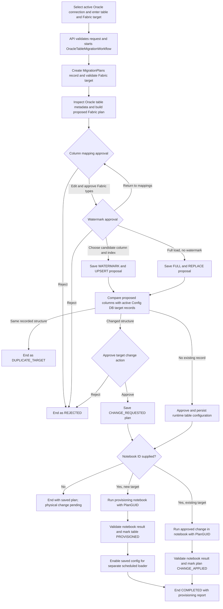

# Oracle table structure migration to Fabric

This document describes the `ORACLE_TABLE` workflow implemented by the FastAPI
page, Temporal worker, Config DB, and Fabric provisioning notebook. Its normal
outcome is an approved Fabric table structure and saved configuration for a
separately scheduled data loader. The workflow does **not** start a replication
pipeline. The target change actions `ALTER_BACKFILL` and `REPLACE_FULL` are
special one-time notebook operations that can move or reload historical data;
they do not start the scheduled pipeline.

## Components and inputs

| Component | Responsibility |
|---|---|
| [Migration page](../../migration_ui.html) | Starts the workflow, presents approvals and status, displays the notebook report. |
| [API](../api.py) | Validates the request and selected connection, starts Temporal, accepts approval signals. |
| [Temporal workflow](../workflow_base.py) | Orchestrates discovery, approvals, Config DB writes, and notebook execution. |
| [Source activities](../source_activities.py) | Connect to Oracle and discover table columns, keys, indexes, and watermark candidates. |
| [Config DB activities](../config_activities.py) | Persist plans and table metadata; record approvals and provisioning status. |
| [Fabric activities](../fabric_activities.py) | Validate the Fabric target, submit the notebook, poll its job, and parse its result. |
| [Provisioning notebook](../../../thirdparty/fabric/nb_migration_provisioning.py) | Creates or changes the physical Fabric Delta table and returns an object report. |

The user selects an active Oracle connection, then **Oracle table**. They enter
the Oracle schema and table, select an active Fabric workspace from
`bronze_replication.FabricWorkspaces`, then select a Lakehouse returned by the
Fabric API for that workspace. They also enter the Fabric schema. The workspace
and Lakehouse names appear in dropdowns, while their IDs are submitted.
Target name and requester are optional. A provisioning notebook ID is
also optional: without one, the workflow records the approved plan but does
not create or alter a physical table. The UI currently prefills notebook ID
`5b8a6415-f6b9-4890-8bc5-226528914c59`; check that the deployed Fabric item
contains the current notebook code. The UI does not request a replication
pipeline ID.

Allowed migration types for each connection type are in
[migration_types.json](../../../thirdparty/configdb/migration_types.json). The
API serves the choices at `GET /migrations/options` and checks that an Oracle
connection is used for `ORACLE_TABLE`. Oracle credentials are read by an
activity from `DBConnections.ConnectionDetails`; they are not placed in the
Temporal workflow input. The UI loads active Fabric workspaces from
`GET /workspaces`, and the start API checks the selected ID against that
registry. Selecting a workspace loads its Lakehouses from
`GET /workspaces/{workspace_id}/lakehouses`, which calls Fabric's paginated
Lakehouse listing API. The worker validates the chosen Fabric IDs before
discovery and provisioning.

## End-to-end flow

### 1. Discover and propose column types

The worker tests the selected Oracle connection and inspects the named table.
It captures ordered columns, source data types, descriptions, primary and unique
keys, and date/timestamp watermark candidates with available index names. The
type mapper reads
[oracle_type_mapping.json](../../../thirdparty/oracle/oracle_type_mapping.json).
The proposed Fabric type and a warning appear in the column grid. A reviewer
can change each Fabric type; every discovered column must be represented once.
Unsupported mappings require an explicit acknowledgement before approval.

### 2. Choose the future load method

The second approval lists the discovered watermark candidates and a **Full load
(no watermark)** choice. Selecting a watermark requires a primary key. The
workflow saves `IncrementalMethod=WATERMARK`, `WriteStrategy=UPSERT`, the chosen
column and source type, and a selected source index name if one was found.
Choosing full load saves `IncrementalMethod=FULL`, `WriteStrategy=REPLACE`, and
no watermark column or index. These settings are future loader configuration;
this workflow does not load rows through the scheduled replication pipeline.

### 3. Review an existing target

The workflow compares the proposed columns with active **Config DB records**
for the same workspace, Lakehouse, schema, and table. An identical saved
structure ends as `DUPLICATE_TARGET`; no second runtime table row is created.
For a changed structure, the reviewer chooses one of these actions:

| Existing record | Action | Effect after notebook approval |
|---|---|---|
| Pending | `REVISE_PLANNED` | Revises the saved configuration before a physical table is created. |
| Provisioned | `ALTER_FUTURE` | Alters supported columns in place; prior rows are not backfilled. |
| Provisioned | `ALTER_BACKFILL` | Alters supported columns and performs a one-time historical backfill. |
| Provisioned | `REPLACE_FULL` | Rebuilds the target from a full source snapshot. |

This first comparison uses saved metadata, so it cannot prove the physical
Fabric table is present or unchanged. The notebook checks its Lakehouse target
and physical schema before applying a change. See the
[target change notebook contract](../../../thirdparty/fabric/TARGET_CHANGE_NOTEBOOK_CONTRACT.md)
for the exact safety checks, Oracle access, locking, and recovery behavior.

### 4. Save the plan and provision Fabric

For a new table, the approved runtime plan writes `SourceTables`,
`SourceTableColumns`, and `ReplicationConfig` in Config DB. With a notebook ID,
the worker submits only `plan_guid` as a notebook parameter, polls the Fabric
job, parses the notebook's JSON exit value, and marks the table and plan
`PROVISIONED` only after the notebook reports success. It then sets the saved
replication configuration as eligible for the separate scheduler. It does not
mark `ReplicationState` as running and does not submit a pipeline job.

For an existing target, the approved change is saved in `MigrationPlans.Notes`
with status `CHANGE_REQUESTED`. The same notebook receives the change plan GUID
and reads the approved action from Config DB. After a successful one-table
report, the workflow sets the change plan to `CHANGE_APPLIED`. A previously
closed `CHANGE_REQUESTED` workflow cannot be resumed by restarting a worker;
start a new workflow for another approval and execution.

The notebook returns overall `SUCCESS` or `FAILED`, object names and statuses,
and elapsed times. Fabric's job status can say `Completed` even when the
notebook's exit JSON says `FAILED`; the app must accept the notebook report as
the outcome of provisioning. The UI displays the parsed report. If the
notebook ID is omitted, the approved configuration remains saved with no
physical provisioning.

## Operational boundaries

- Run the API and Temporal worker separately. In Windows Command Prompt, use
  `venv\Scripts\python.exe -m app.migration.worker` for the worker. The API
  can run with `venv\Scripts\python.exe -m uvicorn app.main:app --reload`.
- The worker and API must use the same Temporal server, namespace, and task
  queue. A running API alone will leave activities queued.
- The Fabric notebook item must be attached to the approved target Lakehouse.
  Updating the repository's `.py` or `.ipynb` does not update the deployed
  Fabric notebook item.
- `ALTER_BACKFILL` and `REPLACE_FULL` require
  [migration 003](../../../thirdparty/configdb/migrations/003_target_change_runs.sql),
  Oracle access from the Fabric notebook, and an idle scheduled loader.
- This workflow provisions structure and records future load settings. The
  dedicated pipeline owns its schedule, row ingestion, watermark advancement,
  and recurring retry policy.
